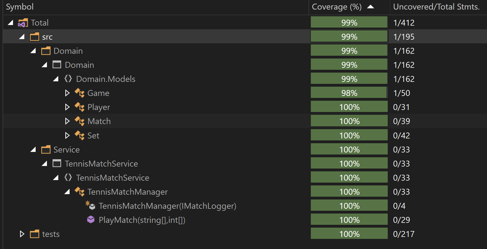

# Tennis Match Simulator

## Project Description

This project is a .NET 7 application that simulates a Tennis Match. It leverages several modern technologies and design patterns to ensure maintainability, scalability, and performance. The application follows the multi layer approach, with API calling the Service Layer that interacts with Domain Layer.

## Technology Stack

- .NET 7
- C#
- FluentValidation
- Exception Handling & Logging
- Docker
- xUnit and FluentAssertions

## Architecture

The project follows the multi layer pattern. In a real-world scenario, there will be an actual database also where the data will be saved by a persistence layer.


### Layers

1. **API Layer**
    - Contains the minimal api routes to simulate a tennis match.
    - Contains a Console Application to simulate a tennis match.
2. **Service Layer**
    - Contains the TennisMatchManager to work with Domain layer models like Match, Set, Game and Player.
    - Contains the Logger to log the match progress.
3. **Domain Layer**
    - Contains the domain models and the business logic for simulating the tennis match.
    - Proper responsibility seggregation is done for Match, Set, Game and Player logic.
4. **Tests**
    - Contains the tests for Domain and Service Layer.

## Instructions to Run

### Using Docker

1. Ensure you have Docker installed and running on your machine. You can start the application using Docker Compose with the following commands:

   ```bash
   # To execute console application:
   docker-compose up

   # To execute rest api:
   docker compose -f .\docker-compose.api.yml up
   ```
2. If executing RestApi, Browse [http://localhost:5000/swagger/index.html](http://localhost:5000/swagger/index.html) on your browser to simulate the tennis match.

### Using Visual Studio
1. Open the solution in Visual Studio.
2. Build the solution to restore the necessary packages and compile the project.
3. Set the startup project to the RestApi or ConsoleApp project.
4. Run the application.
5. You can also use dotnet run to execute the respective Api.

    ```
    # To execute RestApi
    cd .\src\Api\RestApi
    dotnet run

    # To execute Console Application
    cd .\src\Api\ConsoleApp
    dotnet run
    ```

## Continuous Integration

A GitHub workflow has been set up to build and test the project automatically. The workflow file is located in the .github/workflows directory.

## Repository Summary

### API Routes

The API layer exposes several routes for simulating the Tennis Match. Below is an example of the available routes:

- `POST /api/playMatch` - Simulate a Test Match, by sending player names and points data in payload.

### Console Application

The Console Application passes a list of players and points data to simulate a tennis match. 

- Call the service layer (TennisMatchManager) to simulate the tennis match.

### Service Layer

- **Tennis Match Manager**: Service layer working on the domain layer to register the points and declare the winner.
- **Logger**: To log the match progress during the simulation.

### Domain Layer

- **Models**: Define the core business entities.
- **Business Logic**: Contains the logic to work with Match, Game, Set and Player. Match is the entry point, which works with Game, Set and Player.

## Data

### Assumptions
1. The match summary is just logged on console using ILogger.
2. Always the two players need to be sent.
3. If either of player does not win 3 set at the end of match, the match is assumed "Not Finished".
4. Any point sent after the match is over will be ignored and won't be registered.
5. No security or authorisation is required.

### Sample Data
I have already simulated a tennis match in Console Application.

E.g.: Simulation for winner Player A

    
    # Input Data
    Players: ["Player 1", "Player 2"]

    Points: 
    { 
        0, 0, 0, 0, 
        0, 0, 0, 0, 
        0, 0, 0, 0, 
        0, 0, 0, 0, 
        0, 0, 0, 0, 
        0, 0, 0, 0, // Player 1 win 6-0
        
        0, 0, 0, 0, 
        0, 0, 0, 0, 
        0, 0, 0, 0, 
        0, 0, 0, 0, 
        0, 0, 0, 0, 
        0, 0, 0, 0, // Player 1 win 6-0
        
        1, 1, 1, 1, 
        0, 0, 0, 0, 
        0, 0, 0, 0, 
        0, 0, 0, 0, 
        1, 1, 1, 1, 
        0, 0, 0, 0, 
        1, 1, 1, 1, 
        0, 0, 0, 0, 
        0, 0, 0, 0 // Player 1 win 6-3
    }
    


### Unit Tests:
Proper unit tests are added for the domain and service layer, where all the business logic is written and executed.

Unit Tests Coverage:

